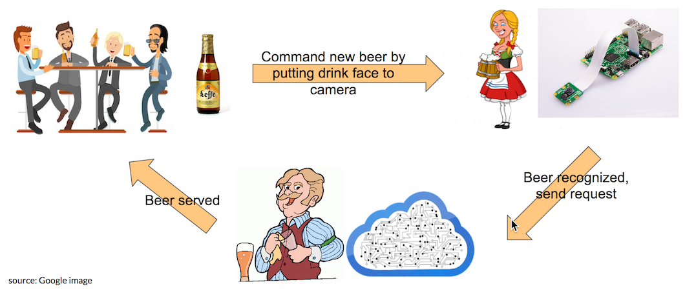
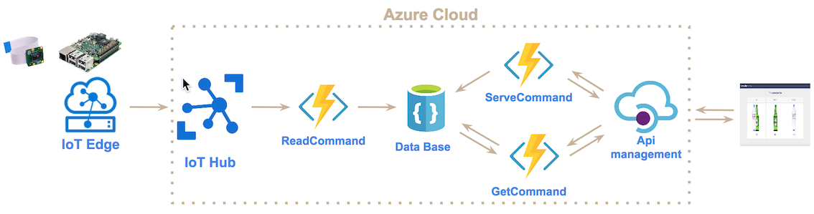

# IoT platform with Azure cloud

## Objective

The main objective of this project is to build an IoT plateform with Azure cloud.

In our case the IoT platform is a connected bar. Indeed, through a raspberry pi with an integrated camera you will be able to order a new drink by just putting your drink in front of the camera.

A machine learning model is installed on the device which recognized the type of drink and requests a remote barter in the cloud to prepare the same drink.

The following picture shows you how it works.

## Architecture in the cloud

In terms of Azure components, here is the corresponding architecture :

Here is the meaning of each services:

- Azure IoT Hub : service to declare devices, to communicate with them through the protocol MQTT
- Azure Functions : serverless service that executes a programmed function from an event (new device message, http request..)
- Azure IoT Egde : service installed in device that enables tasks on device. Here, it controls camera, does image recognition and sends request to Iot Hub
- Azure CosmosDB : data base that is used to stored all commands
- Azure Api Management : service that manages REST API

About the three functions we created :

- ReadCommand : receive command and store in data base with status "not served"
- GetCommand : return all unserved command
- ServeCommand : for a command, change status to "served"

## Installation

### Installation of Azure cli

The deployment is done through azure cli. So, you first need to install azure-cli depending your OS

    // For Mac 
    brew update && brew install azure-cli
    
### Connection to Azure Cloud with Azure cli

Link azure-cli with your Azure account : 

    az login

### Deploy Architecture

Run the script to install all services in the cloud :

    ./create-iot-architecture.sh
    
You will get as output :

- Connection string for device named "connected_bar_device"
- Connection string for edge device that you will use for installation of Iot Egde

In order to install Iot Edge in your raspberry pi, you have to follow this [link](https://docs.microsoft.com/en-us/azure/iot-edge/how-to-install-iot-edge-linux).

    
  